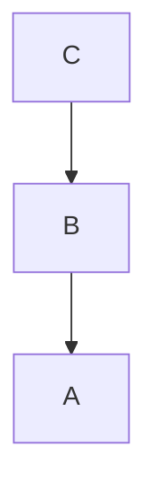
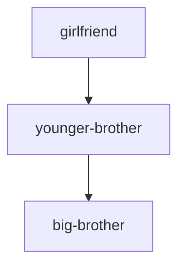

위 구조로 패키지를 생성한다. 단, 이 때 `artifactId` 를 반드시 일치시켜야 한다. 
해당 프로젝트는 간단하게 github 로 부여하였다. 따라서 각 프로젝트는 `com.example.github` 로 시작하게 된다.

()



`girlfriend` 어플리케이션에서는 `younger-brother`, `big-brother` 의 패키지에 접근할 수 있게 된다.


```java
package com.example.github.girlfriend;

import com.example.github.bigbrother.BigBrother;
import com.example.github.younger.YoungerBrother;
public class GirlFriend {

    public void girlFriend() {
        BigBrother bigBrother = new BigBrother();
        YoungerBrother youngerBrother = new YoungerBrother(bigBrother);

    }
}
```
따라서, 이를 잘 활용하면 
- 서비스
- 엔티티
- 인터페이스

등을 나누어서 통합적으로 관리할 수 있다
